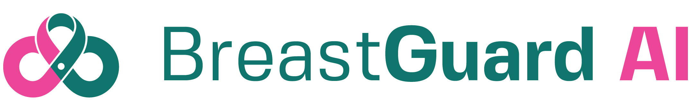

<div align="center">
  
  <h1>Web Application</h1>
  <p><strong>AI-Powered Breast Cancer Screening Platform</strong></p>
  <p>
    
    
    
    
  </p>
</div>

## About BreastGuard Web

The **BreastGuard Web Application** is a modern React-based platform developed by **Makerere University Group 11** under the supervision of **Dr. Emmanuel Lule**. It provides an intuitive web interface for AI-powered breast cancer screening and clinical decision support.

### Key Features

- **Interactive AI Assistant**: User-friendly interface for uploading histopathology images and running AI analysis
- **Patient Risk Assessment**: Comprehensive forms for capturing patient demographics and clinical history
- **Visual Results Dashboard**: Clear presentation of AI findings with confidence scores and risk levels
- **Grad-CAM Explanations**: Visual attention maps showing regions influencing AI decisions
- **Guideline Integration**: Reports grounded in WHO, Uganda MoH, and NCCN clinical guidelines
- **Responsive Design**: Works seamlessly on desktop, tablet, and mobile devices

### Technology Stack

| Component | Technology |
|-----------|------------|
| Framework | React 18+ |
| Build Tool | Vite 5.x |
| Language | TypeScript |
| Styling | Tailwind CSS |
| UI Components | shadcn/ui + Radix UI |
| State Management | Zustand |
| Routing | React Router v6 |
| Icons | Lucide React |
| AI Integration | Hugging Face Inference API |

## Project Structure

```
src/
├── assets/                   # Static assets (logo, images, backgrounds)
│   ├── logo wordmark.webp    # BreastGuard brand logo
│   ├── bg2.webp             # Desktop background
│   └── bg2.jpg              # Mobile background
├── components/               # Reusable UI components
│   ├── ui/                  # shadcn/ui components
│   ├── FormInputs.tsx       # Custom form components
│   ├── LoadingSpinner.tsx   # Loading states
│   └── ...
├── pages/                    # Route-level page components
│   ├── AIAssistantPage.tsx  # Main AI assessment interface
│   ├── HomePage.tsx         # Landing page
│   ├── AboutPage.tsx        # About the project
│   └── ...
├── services/                 # API integration
│   └── hfApi.ts            # Hugging Face API client
├── store/                    # State management (Zustand)
│   └── appStore.ts
├── styles/                   # CSS modules and styles
├── utils/                    # Helper functions
└── App.tsx                   # Root component
```

## Getting Started

### Prerequisites

- Node.js 18+ and npm/yarn/pnpm
- Modern web browser
- Hugging Face API token (for AI integration)

### Installation

1. Clone the repository:
   ```bash
   git clone <repository-url>
   cd BCan-Scan
   ```

2. Install dependencies:
   ```bash
   npm install
   # or
   yarn install
   # or
   pnpm install
   ```

3. Configure environment:
   ```bash
   cp .env.example .env
   # Edit .env with your Neon database URL and a strong JWT_SECRET
   ```

4. Set up the database:
   ```bash
   npx prisma migrate dev --name init
   npx prisma generate
   ```

5. Start development server:
   ```bash
   npm run dev
   # or
   yarn dev
   # or
   pnpm dev
   ```

6. Open http://localhost:5173 in your browser

### Auth Backend

Authentication is backed by **Neon Postgres** via **Prisma**. The local dev server (`npm run server`) exposes the same endpoints that are deployed as Vercel serverless functions:

- `POST /api/auth/signup`
- `POST /api/auth/login`
- `GET /api/auth/me`
- `POST /api/auth/logout`

Required environment variables:

| Variable | Description |
|----------|-------------|
| `DATABASE_URL` | Neon Postgres connection string |
| `JWT_SECRET` | Secret used to sign JWT tokens |
| `JWT_EXPIRES_IN` | Token lifetime (default: `7d`) |
| `BCRYPT_ROUNDS` | Password hashing cost (default: `12`) |

### Building for Production

```bash
npm run build
# or
yarn build
# or
pnpm build
```

The build output will be in the `dist/` directory.

## Brand Colors

| Color | CSS Variable | Hex Code | Usage |
|-------|-------------|----------|-------|
| Primary (Teal) | `--primary` | `#0f766e` | Headers, primary actions, tabs |
| Secondary (Pink) | `--secondary` | `#ec4899` | CTAs, badges, accents, highlights |
| Success | `--success` | `#16a34a` | Benign findings, positive indicators |
| Danger | `--danger` | `#dc2626` | Malignant findings, errors, alerts |
| Warning | `--warning` | `#ea580c` | Cautionary information |
| Gray Scale | `--gray-50` to `--gray-900` | Various | Text, backgrounds, borders |

## AI Model Architecture

The web app interfaces with our **BreastGuard AI Model** on Hugging Face Spaces:

### Hybrid Deep Learning Approach

1. **Image Analysis**: EfficientNetB3/ResNet50 CNN processes histopathology images
2. **Texture Features**: HGLCM (Haralick GLCM) extracts texture patterns from tissue samples
3. **Risk Factors**: Random Forest classifier evaluates patient demographics and clinical history
4. **RAG Pipeline**: Retrieves relevant clinical guidelines from WHO, Uganda MoH, and NCCN
5. **Explainability**: Grad-CAM generates visual attention maps for clinician interpretation

### API Integration

```typescript
// Example usage
const result = await runInference({
  image: histopathologyImage,
  age: 45,
  symptomDuration: 4,
  famHist: "No",
  reproHist: "Normal",
  query: "Recommended next steps?"
});
```

## Development Guidelines

### Code Style

- Use TypeScript for all new components
- Follow React functional component patterns with hooks
- Use Tailwind CSS for styling (avoid inline styles)
- Implement proper error boundaries
- Add loading states for async operations

### Component Conventions

```tsx
// Page component example
export default function PageName() {
  // Component logic
  return (
    <div className="container">
      {/* Content */}
    </div>
  );
}
```

## Team

**Makerere University - Group 11**  
**Supervisor:** Dr. Emmanuel Lule  
**Project:** Breast Cancer Screening AI for Uganda

| Team Member | Role | Tasks Assigned |
|-------------|------|----------------|
| **Karungi Maria Daphine** | Image Classification & Model Training | EfficientNetB3 + HGLCM hybrid CNN design, two-phase training, threshold optimisation |
| **Apio Diane** | Deployment & Data Acquisition, Data Preprocessing | HuggingFace Spaces deployment, BreakHis dataset acquisition, EDA and CLAHE preprocessing |
| **Mutska Emmason** | Evaluation & RAG Pipeline, Project Manager | RAG pipeline (LangChain/FAISS), technical metrics, UAT coordination, overfitting mitigation; overseeing progress, coordinating meetings, ensuring deadlines are met |
| **Rwothomio Jonathan** | Risk Model & Explainability | Random Forest risk model, SHAP visualisations, Grad-CAM, report writing and presentation |

## Acknowledgments

- **WHO** - Breast Cancer Guidelines 2022
- **Uganda Ministry of Health** - Cancer Guidelines 2020
- **NCCN** - Guidelines v2024
- **Hugging Face** - Model hosting and inference API

## License

This project is part of academic research at Makerere University. All rights reserved.

## Disclaimer

⚠️ **For clinical decision support only.** All AI outputs must be reviewed by a qualified clinician. Confirm findings with clinical breast examination, imaging, and biopsy as appropriate.

---

<p align="center">
  <sub>Built with ❤️ for better healthcare in Uganda</sub>
</p>
